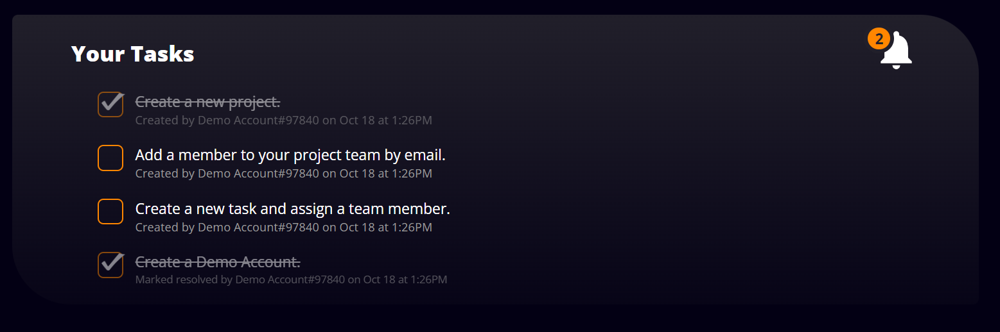

## About Bug Quack

Bug Quack is a project management system for tracking bugs and managing tasks efficiently. Bug Quack is a full-stack demo project for my <a href="https://woox99.github.io/Portfolio/" target="_blank">portfolio</a>, and was my 3rd ever, non-tutorial project built. Quickly access the full functionality of the website with a Demo Account <a href="" target="_blank">here</a>. 

## Build Stack

    

## Overview
* Leveraged Java Spring Boot for rapid development, capitalizing on its streamlined setup and configuration.
* Implemented Spring Data Persistence API for object-relational mapping, simplifying interaction with MySQL
relational database through standardized repository interfaces.
*  Achieved a seamless user experience through asynchronous data loading with AJAX.

## Feature Walkthrough

🔒 User Authentication & Authorization

 

* Password ***hashing***
* Registration ***validation***
* Route protection
* Demo Account

---

 

 

***Create*** a project and ***add team members***.

* One-to-many relationship between project and ***owner***.
* Many-to-many relationship between projects and ***teams***.

---

 

 

***Create*** a task and ***assign*** it to one, or multiple team members. 

* Many-to-many relationship between tasks and ***assigned members***.

---

 

 

View and manage your tasks by marking them ***resolved***, or ***unresolved***.

---

 

 

View and manage your team's tasks.

---

 

 

Change the color theme with the ***color selector***.

---

 

 

***Responsive*** design to fit any device.

